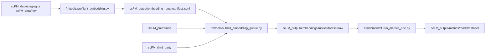

# scFM Architecture

`scFM/` is code only. Inputs, checkpoints, third-party source mirrors, and
outputs are sibling directories.

- `fm/paths.py` is the source of truth for default roots.
- `SCFM_DATA_ROOT`, `SCFM_PRETRAINED_ROOT`, `SCFM_THIRD_PARTY_ROOT`, and
  `SCFM_OUTPUT_ROOT` override the sibling defaults.
- `python -m tools.validate_resources` reports the resolved layout and missing
  resources before live export.
